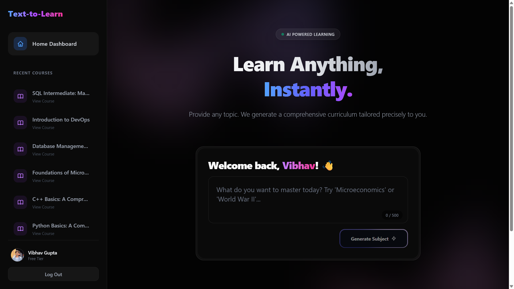
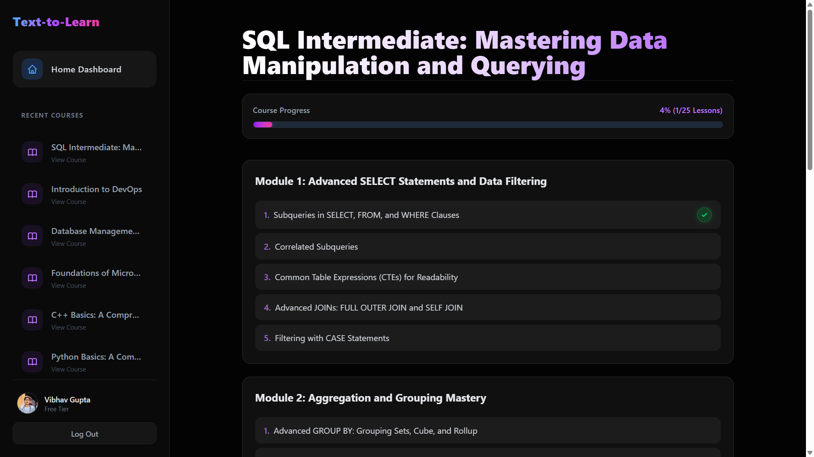
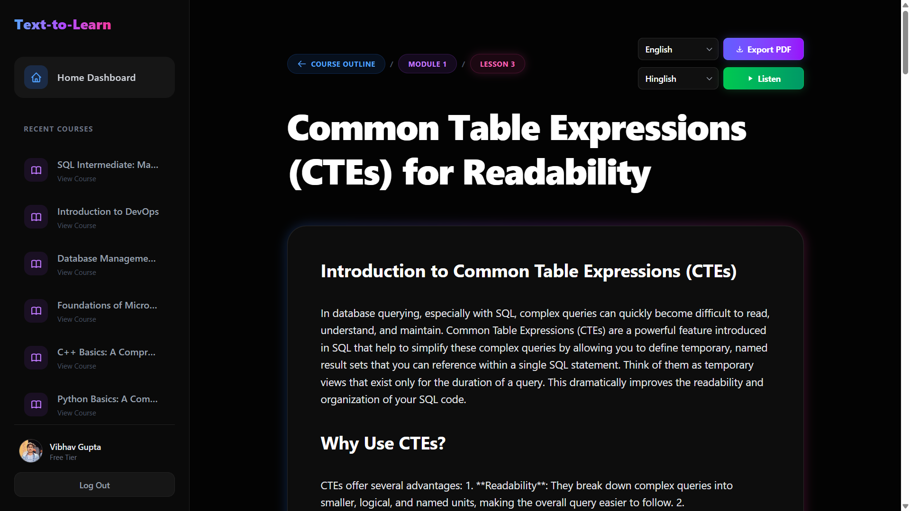
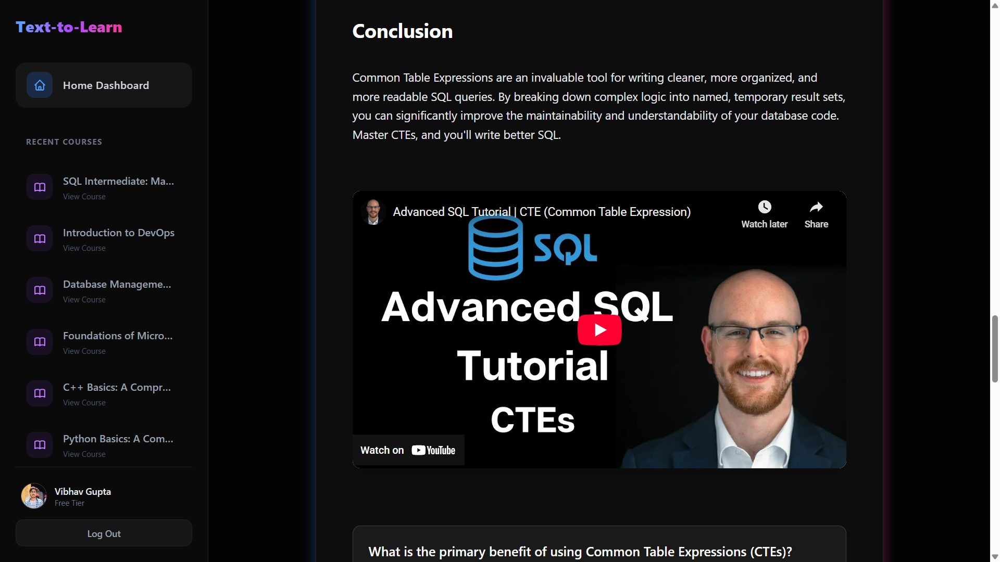
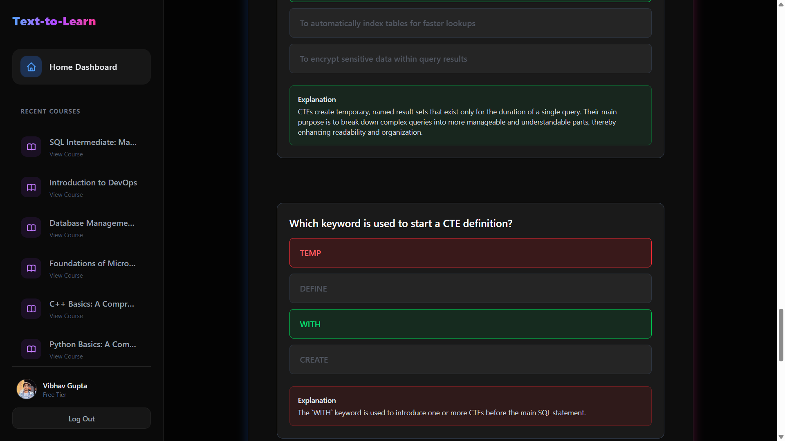

# 🚀 Text-to-Learn | *AI Course Generator*

> **Text-to-Learn** is a full-stack, AI-powered educational platform. By leveraging cutting-edge Artificial Intelligence, the application empowers users to generate modular courses, dynamic lessons, interactive MCQs, multilingual text-to-speech audio, and even relevant YouTube video integrations instantly!

Built with a robust React frontend and an Express-powered scalable backend, it showcases end-to-end full-stack capabilities, enterprise-grade security via **Auth0**, and complex orchestrations of multiple third-party API services (Google Gemini LLM, Google TTS, YouTube Data API).

---

## 📸 Platform Sneak Peek

<div align="center">


<br><em><b>Figure 1: Home Dashboard & Initial Generation Prompt</b></em><br><br>


<br><em><b>Figure 2: Structured Course Outline Generation</b></em><br><br>


<br><em><b>Figure 3: Rich Lesson Rendering (Markdown, Syntax Highlighting, TTS)</b></em><br><br>


<br><em><b>Figure 4: Dynamic Seamless YouTube Integrations</b></em><br><br>


<br><em><b>Figure 5: On-the-fly MCQ and Quiz Generation</b></em><br><br>

</div>

---

## ✨ Key Features & Technical Marvels

- **🧠 Full-Stack AI Pipeline**: Instantly generates well-structured learning modules and detailed markdown lessons from user-provided prompts using **Google Gemini LLM**.
- **🎥 Dynamic YouTube Integrations**: Automatically fetches and embeds hyper-relevant YouTube videos directly into the generated coursework to supplement text-based learning visually.
- **🗣️ Full-Lesson Translation & Multilingual TTS**: Completely translate entire generated lessons on the fly! Features integrated dynamic Text-to-Speech support, enabling automatic Hinglish, Pure Hindi, and Tamil text translation and audio narration via Google APIs for unmatched accessibility.
- **📄 High-Fidelity PDF Export**: Designed PDF lesson export functionality using `react-to-print`, allowing users to download visually accurate, heavily formatted modular lessons entirely offline.
- **📊 Integrated Quiz Generation**: Rapidly generates end-of-lesson multiple-choice questions (MCQs) to rigorously test knowledge retention and user engagement.
- **📈 Progress Tracking**: Built-in visual indicators and completion tracking to monitor individual course progression effortlessly.
- **🌙 Native Dark Mode**: A stunning, accessible, and sleek default Dark Mode user interface built with **Tailwind CSS**, featuring glassmorphic elements, engaging hover states, and seamless micro-animations.
- **🔐 Enterprise-Grade Security**: Secured from end-to-end with **Auth0**. Implemented custom Express middleware including `express-jwt` and `jwks-rsa` for robust API route protection and centralized error handling.
- **⚡ Scalable RESTful Backend**: A high-performance REST API utilizing Node.js, Express, and MongoDB (Mongoose), managing complex hierarchical data relationships (Course ➔ Module ➔ Lesson) tied securely to individual users.

---

## 🛠️ Technology Stack

### **Frontend  💻**
- **Framework**: React 18, Vite
- **Styling**: Tailwind CSS
- **Routing**: React Router DOM
- **Authentication**: Auth0 React SDK (`@auth0/auth0-react`)
- **HTTP Client**: Axios
- **Utilities**: React-to-Print

### **Backend  ⚙️**
- **Runtime**: Node.js
- **Framework**: Express.js
- **Database**: MongoDB (Mongoose)
- **AI Integration**: Google Gen AI SDK (`@google/genai`)
- **Media & Audio**: Google TTS API (`google-tts-api`), YouTube Data API
- **Security**: `express-jwt`, `jwks-rsa`, `express-rate-limit`, `cors`

---

## 📂 Complete Project Structure

```text
Text-to-Learn/
├── backend/
│   ├── controllers/      
│   │   └── courseController.js       # Core business logic for course CRUD and LLM pipeline
│   ├── middleware/       
│   │   └── auth.js                   # JWT Validation and rate-limit logic
│   ├── models/           
│   │   ├── Course.js                 # Course schema with deeply nested sub-documents
│   │   ├── Lesson.js                 # Lesson content schema
│   │   └── Module.js                 # Module breakdown schema
│   ├── routes/           
│   │   └── courseRoutes.js           # RESTful endpoint definitions
│   ├── services/         
│   │   ├── geminiService.js          # Google Gemini LLM API abstraction layer
│   │   └── youtubeService.js         # YouTube Data API abstraction layer
│   ├── server.js                     # Express setup, middleware injection, DB connection
│   └── package.json
└── frontend/
    ├── public/
    ├── src/
    │   ├── components/   
    │   │   ├── blocks/               # Modular UI blocks (e.g. MCQ rendering block)
    │   │   ├── LessonRenderer.jsx    # React Markdown logic parser
    │   │   ├── PromptForm.jsx        # Landing page prompt component
    │   │   └── SidebarNavigation.jsx # Application-wide navigation skeleton
    │   ├── pages/        
    │   │   ├── CoursePage.jsx        # Course outline overview dashboard
    │   │   ├── Home.jsx              # Application landing layout
    │   │   └── LessonView.jsx        # Heavy data-fetching layout for lesson interaction
    │   ├── App.jsx                   # React Router DOM context wrapper
    │   └── main.jsx                  # Auth0 Provider and DOM mounting
    ├── index.html
    ├── vite.config.js
    └── package.json
```

---

## 📋 Prerequisites

Ensure you have the following installed on your machine:
- 🟢 **Node.js** (v18.0 or higher)
- 🍃 **MongoDB** (Local instance or MongoDB Atlas cluster)
- 🛡️ **Auth0 Account** (To configure Domain, Client ID, and Audience API)
- 🔑 **Google Gemini API Key** (Generated via Google AI Studio)
- 🔴 **YouTube Data API Key** (Generated via Google Cloud Console)

---

## 🚀 Installation & Setup

### 1. Clone the Repository
```bash
git clone https://github.com/your-username/text-to-learn.git
cd text-to-learn
```

### 2. Backend Setup
Navigate to the backend directory and install dependencies:
```bash
cd backend
npm install
```

Create a `.env` file in the `/backend` directory:
```env
PORT=5000
MONGO_URI=your_mongodb_connection_string
GEMINI_API_KEY=your_google_gemini_api_key
YOUTUBE_API_KEY=your_youtube_api_key

# Auth0 Backend Verification
AUTH0_ISSUER_BASE_URL=https://your-auth0-domain.us.auth0.com/
AUTH0_AUDIENCE=your_auth0_api_audience
```

Start the backend development server:
```bash
npx nodemon server.js
```

### 3. Frontend Setup
Open a new terminal, navigate to the frontend directory, and install dependencies:
```bash
cd frontend
npm install
```

Create a `.env` file in the `/frontend` directory:
```env
VITE_API_BASE_URL=http://localhost:5000

# Auth0 Frontend Config
VITE_AUTH0_DOMAIN=your-auth0-domain.us.auth0.com
VITE_AUTH0_CLIENT_ID=your_auth0_client_id
```

Start the Vite development server:
```bash
npm run dev
```

---

## 💻 Usage Guide

1. 👤 **Sign Up / Log In**: Click the Login button in the sidebar. You will be authenticated securely via Auth0. Unauthenticated users will be met with a custom modal restricting course generation.
2. ✍️ **Generate a Course**: On the main dashboard, type any topic you wish to learn about and submit. The multi-stage AI pipeline will orchestrate your learning material.
3. 📚 **Explore Lessons**: The AI will generate a structured module list. Click on any module/lesson to render the detailed Markdown content alongside curated YouTube videos and MCQs.
4. 🎧 **Listen to the Lesson**: In the Lesson View, select your preferred language (Hinglish/Hindi/Tamil) from the dropdown and hit **Play** to hear the TTS reader.
5. 📥 **Download as PDF**: Click the **Export** button in the top right of the lesson header to beautifully convert and save your lesson visually for offline usage.

---

## 🗺️ Roadmap / Future Enhancements

- [ ] 🌐 **Social Sharing**: Share generated courses and content trees via public, read-only links with peers.

---

<p align="center">
👨‍💻 <b>Developed by <a href="https://www.linkedin.com/in/vibhavgupta30/">Vibhav Gupta</a></b>
</p>
